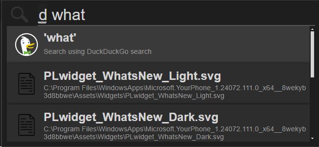

# jseek - search anything

jseek is a GUI based search tool, which can search for anything, like files, folders, programs, web, etc. It is based on [Everything](https://www.voidtools.com/), so you need to have Everything installed on your system.

## Searching

You can search for anything, you can filter results, using following keywords:

- **`<anything>`** Search for anything (file, folder, program, web..)
- **`file:<>`** Search for files
- **`folder:<>`**  Search for folders

- **`ext:extension`** **`*.<ext>`** Search for files with extension
- **`size:<>`** Search for files with size
- [And more...](https://www.voidtools.com/support/everything/searching/) _Note: Not all features cannot be used in jseek, becase some are really slow and will cause lag_ [The full list of search syntax in jseek](src/config.js)

- Web search
  - **`g <>`** Search for web using Google
  - **`y <>`** Make a Youtube search
  - **`b <>`** Search for web using Bing
  - **`d <>`** Search for web using DuckDuckGo
  - **`w <>`** Search for web using Wikipedia
- **`><>`** Run command
  - **`><>!`** Run command in elevated mode _**not implemented yet**_

## coming soon

- **`#:<>`** Search for the Recent files
  - **`C:\Users\%USERNAME%\AppData\Roaming\Microsoft\Windows\Recent`** Search in Recent
- **`eg. 1(2+4)`** Calculate math expression
  - **`eg. 1(2+4) -> [hex|bin|oct]`** Convert math expression to hex, bin, oct
  - **`[hex|bin|oct] -> [hex|bin|oct|dec]`** Convert number to hex, bin, oct, dec
- **`p:<>`** Search programs in PATH, Start Menu..
  - All the path where the programs exe or shortcut is located
    - **`%PATH%`** Search in PATH
    - **`C:\Users\%USERNAME%\AppData\Roaming\Microsoft\Windows\Start Menu`** Search in Start Menu
    - **`C:\ProgramData\Microsoft\Windows\Start Menu`** Search in Start Menu
    - Everything search `<C:\Users\%USERNAME%\AppData\Roaming\Microsoft\Windows\Start Menu\ | C:\ProgramData\Microsoft\Windows\Start Menu\> *.lnk`

Without adding any keyword, it will search for the best match.
